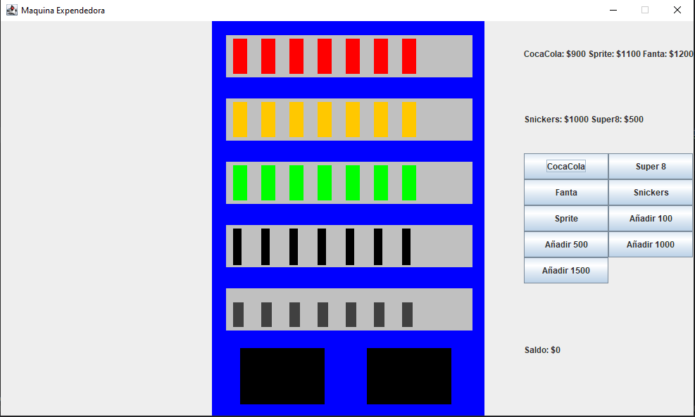
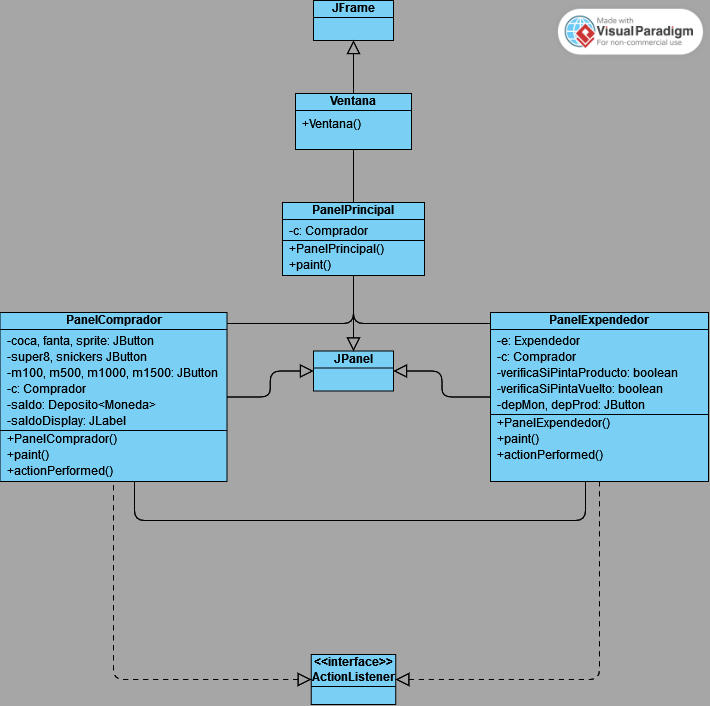

# Tarea 3 Programación II
Repositorio tarea 3.
## Integrantes
- Martin Alonso Lara Castro
- Benjamín Cristobal Villarroel Rubio
## Ventana e implementación
La ventana debería verse de la siguiente forma:

- Las monedas (saldo) se agaregan clickeando los botones de agregar moneda.
- Al tener saldo suficiente, si compramos un producto este desaparecerá del depósito, y caerá al depósito inferior para retirarlo.
- En un JLabel se ve la información de los precios de los productos, o el saldo disponible que es calculado constantemente luego de realizar cada evento
- Al clickear el producto para retirarlo, este desaparece, interpretandolo como que el comprador lo recogió/consumió

El depósito inferior derecho estaba ideado para que se tomase el vuelto clickeandonlo. Se implementó el botón transparente, sin embargo faltó la parte gráfica y hacerlo funcionar.

A la izquierda se ideaba agregar un panel informativo que indicase las acciones realizadas. Sin embargo, al final se hace en consola.
## Diagrama de clases
GUI UML

UML Codigo

